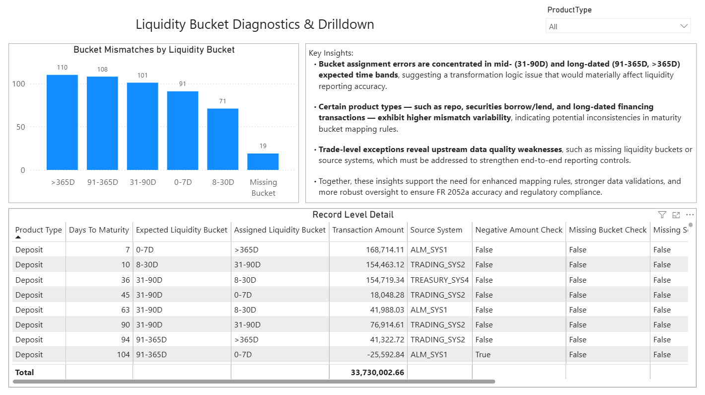

# fr-2052a-liquidity-dq-assessment
FR 2052a liquidity reporting – data quality and transformation logic assessment using SQL, Python, and Power BI.

Project Overview

This project simulates a real-world FR 2052a liquidity reporting governance environment to evaluate data quality, bucket transformation accuracy, and trade-level exceptions across a synthetic dataset of liquidity transactions.

The workflow mirrors how Regulatory Reporting Governance, Internal Audit, and Data Quality Oversight teams review, validate, and escalate issues that impact liquidity reporting accuracy.

Tools & Technologies

Python (Pandas) – Data ingestion, DQ flag creation, export

SQL (SQLite) – Data quality checks, mismatch validation

Power BI – Executive dashboard & drilldown diagnostics

Excel – Initial data exploration

GitHub – Project versioning & documentation

Dataset Description:

Synthetic dataset of 500 records representing typical liquidity trade activity.

Fields include:

✅ProductType

✅DaysToMaturity

✅LiquidityBucket_Label (Assigned)

✅ExpectedBucket

✅Amount

✅SourceSystem

✅Data Quality Flags (generated in Python)

## Data Quality Rules & Regulatory Rationale (FR 2052a)

This project applies governance-grade data quality (DQ) rules aligned to the regulatory intent of FR 2052a liquidity reporting. Each rule directly protects the accuracy of the bank’s reported liquidity position under stress.

---

✅ DQ RULE 1: Missing Liquidity Bucket
Definition: 

A record where the Liquidity Bucket field is blank or null, meaning the trade is not assigned to a contractual maturity time band.

Regulatory Rationale:

FR 2052a requires all positions to be categorized into standardized maturity buckets (e.g., 0–7D, 8–30D, 31–90D, 91–365D, >365D). These buckets determine when cash is actually available under stress.

⚠️ Risk if This Fails:

Trade is excluded or misrepresented in liquidity calculations

Bank’s liquidity gap profile becomes distorted

Creates regulatory credibility risk

Signals a broken enrichment or transformation step

What This Control Protects:

Liquidity timing accuracy

Stress scenario modeling integrity

Downstream regulatory aggregation

✅ DQ RULE 2: Negative Amount Values
Definition: 

Any record where the Amount field is less than zero.

Regulatory Rationale:

FR 2052a measures cash inflows and outflows. Negative balances in assets or improperly signed liabilities can invert liquidity direction, making cash outflows appear as inflows (or vice versa).

⚠️ Risk if This Fails

False liquidity strength

Incorrect net funding position

Potential regulatory misstatement

Indicates sign-flip logic, mapping errors, or broken transformations

What This Control Protects:

Directional cash flow integrity

Net liquidity position accuracy

Model reliability under stress

✅ DQ RULE 3: Missing Source System
Definition: 

Records where the Source System field is blank or null, removing traceability back to the originating platform.

Regulatory Rationale:

Regulators require full data lineage for material regulatory reports. Every reported number must be traceable back to its originating system.

⚠️ Risk if This Fails:

Trade cannot be audited or defended

Breaks data governance standards

Weakens regulatory evidence chain

Increases audit finding and MRA risk

What This Control Protects:

Data lineage integrity

Audit defensibility

Regulatory transparency

✅ DQ RULE 4: Liquidity Bucket Mismatch (Expected vs Assigned)
Definition: 

Cases where the assigned liquidity bucket does NOT match the expected bucket derived from Days to Maturity logic.

Example:

Days to Maturity = 10 days

Expected Bucket = 8–30D

Assigned Bucket = >365D → Mismatch

Regulatory Rationale:

FR 2052a liquidity reporting is entirely maturity-driven. Buckets determine:

When liquidity becomes available

Survival horizons under stress

Funding gap exposure

⚠️ Risk if This Fails:

Short-term liquidity appears long-term

Long-term funding appears short-term

Causes severe liquidity horizon distortion

This is one of the highest regulatory severity issues

What This Control Protects:

Contractual maturity accuracy

Stress survival horizon metrics

Liquidity risk classification correctness

✅ DQ RULE 5: Composite DQ Failure Flag (DQ_HasIssue)
Definition: 

A combined rule that flags any record with one or more integrity failures:

Missing bucket

Negative amount

Missing source system

Bucket mismatch

Regulatory Rationale:

Regulators evaluate total population risk, not just individual errors. This composite flag shows overall data health of the liquidity file.

⚠️ Risk if This Fails:

Indicates systemic reporting weakness

Signals repeatable reporting failures

Requires formal remediation and governance escalation

What This Control Protects:

Enterprise-level reporting reliability

Conformance monitoring

Control effectiveness tracking

✅ Why Maturity Logic Matters (Core Regulatory Truth)

FR 2052a answers one fundamental question: How long can this bank survive under liquidity stress?

That answer is calculated by:

When money comes in

When money goes out

Based strictly on contractual maturity timing

If:

Maturity logic breaks →

Buckets misalign →

Liquidity horizons collapse →

Stress survival analysis becomes invalid

That’s why bucket integrity is a Tier-1 regulatory risk.

✅ Why Buckets Must Match Expected Maturity

Buckets are not cosmetic — they are:

The regulatory survival timeline

The input to liquidity gap analysis

The foundation of stress liquidity disclosure

A single large misclassified repo can:

Inflate short-term liquidity

Mask funding shortfalls

Trigger regulatory action if discovered

Data Quality Rules Implemented (SQL-Based)
1. Missing Liquidity Bucket

Flags trades with null or blank LiquidityBucket_Label.

2. Negative Amount Check

Identifies economically invalid transactions.

3. Missing Source System

Detects deficiencies in upstream lineage or enrichment.

4. Liquidity Bucket Misclassification

Compares Assigned vs Expected bucket based on DaysToMaturity.

5. Row-Level Issue Aggregation

Creates DQ_HasIssue to consolidate all rule failures.

Key DQ Results

| Data Quality Issue          | Count   |
| --------------------------- | ------- |
| Bucket Mismatch             | **385** |
| Missing Liquidity Bucket    | **19**  |
| Missing Source System       | **17**  |
| Negative Amount             | **32**  |
| Total Records With ≥1 Issue | **399** |

Dashboard Overview (Power BI)

The dashboard contains two pages structured like a real regulatory reporting review.

## 📊 Tab 1 — Liquidity Overview Dashboard

This dashboard provides a high-level summary of total records, data quality exceptions, and liquidity bucket classification patterns.

This dashboard highlights…

Purpose: Executive-level diagnostic of reporting quality.

Visuals:

✅KPI Cards (Total Records, Issues, Bucket Mismatch Count)

✅Assigned vs Expected Liquidity Bucket Heatmap

✅Total Records by Product Type

Insight:
Significant off-diagonal activity indicates bucket transformation logic issues, particularly for long-dated trades incorrectly mapped into shorter-term buckets.

## 🔎 Tab 2 — Trade-Level Data Quality Drilldown

This page provides a deeper look at bucket-level misclassifications and trade-level exceptions, enabling root-cause analysis for FR 2052a reporting.

Purpose: Detailed investigation and root cause analysis.

Visuals:

✅Bucket Mismatches by Liquidity Bucket (Bar Chart)

✅Trade-Level Exception Table

✅Product Type Slicer

Insight:
Misclassifications are concentrated in 31–90D, 91–365D, and >365D expected buckets—suggesting transformation logic or upstream data enrichment weaknesses.

The drilldown table provides trade-level evidence required for issue management, internal audit testing, and regulatory review.

Key Insights & Business Impact
1. Transformation Logic Issues

Long-dated trades frequently map to incorrect liquidity buckets, affecting the reporting maturity profile in FR 2052a.

2. Product-Level Variability

Securities financing products show higher mismatch variability, indicating inconsistent mapping logic across systems.

3. Upstream Data Quality Gaps

Missing bucket assignments and missing source systems point to enrichment or lineage deficiencies.

4. Regulatory Risk & Control Impact

These findings would influence:

✅Liquidity risk measurement

✅LCR / NSFR interpretations

✅Supervisory expectations for data integrity

✅Regulatory issue management and remediation planning

Repository Contents:

✅liquidity_data_clean.csv — Clean dataset

✅liquidity_with_dq_flags.csv — DQ-enhanced dataset

✅2052A_DQ_Checks.ipynb — Python notebook

✅sql_queries.sql — All DQ SQL rules (included in Python notebook)

✅Liquidity_Reporting.pbix — Full Power BI dashboard

✅README.md — Project documentation
